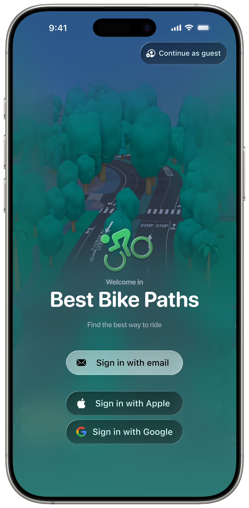
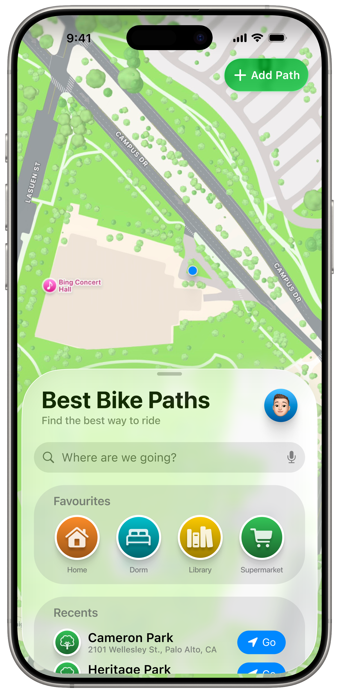
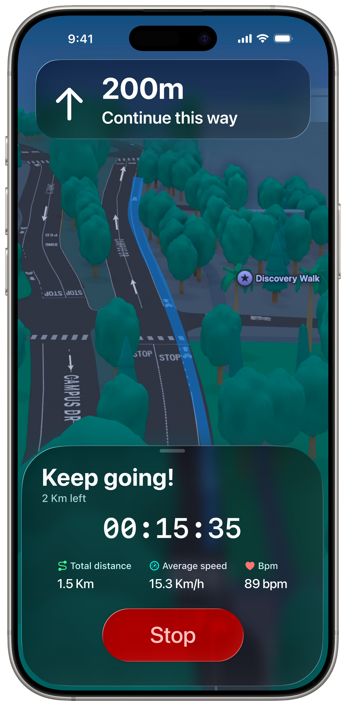
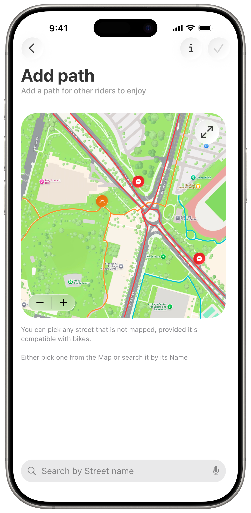
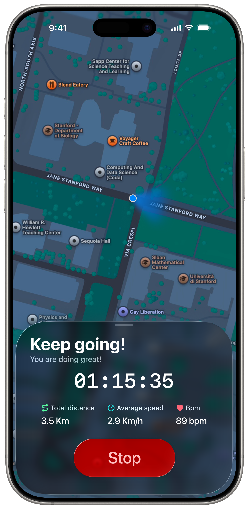

  

# Best Bike Paths

**Best Bike Paths (BBP)** is an integrated platform that bridges this gap by combining personal ride tracking with collaborative mapping of bike path conditions. The system enables cyclists to record and analyse their trips while actively contributing to a shared repository of information regarding path quality, obstacles, and overall cycling experience.

By leveraging both individual data and collective insights, BBP supports informed route selection and fosters a more transparent and reliable cycling environment.

Through this unified approach, BBP aims to enhance the overall cycling experience, empowering users to navigate urban spaces with greater confidence, safety, and awareness, while promoting a community-oriented model of sustainable mobility.

>[!NOTE]
> This project was developed for the Software Engineering 2 course at Politecnico di Milano.
> It's worth half the exam, corresponding to the `R&DD` project.
> It consists of producing two technical documents, a *Requirements Analysis and Specification Document* (RASD) and a *Design Document* (DD).

  <table align="center">
    <tr>
      <td align="center">
        <a href="https://github.com/summacristian">
           
          <b>SummaCristian</b>
        </a> 
        Cristian Summa
      </td>
      <td align="center">
        <a href="https://github.com/mailp99">
           
          <b>Mailp99</b>
        </a> 
        Mathias Rodigari
      </td>
    </tr>
  </table>

# RASD
The *Requirements Analysis and Specification Document* (RASD) focuses on defining the problem domain, identifying stakeholders, and formalizing the system requirements for Best Bike Paths.

It describes the platform’s objectives, the needs it aims to address, and the context in which it operates. The document provides a structured analysis of functional and non-functional requirements, outlining what the system must do and the constraints under which it must operate.

In particular, the RASD includes:

- An overview of the system purpose and scope
- Stakeholder and user identification
- Scenarios and use cases describing expected interactions
- Functional requirements detailing the platform’s core features
- Non-functional requirements such as usability, reliability, and performance
- Domain assumptions, dependencies, and constraints

This document serves as the foundation for the design phase, ensuring that all system features are well-defined and aligned with user needs before implementation decisions are made.

  

# DD
The *Design Document* (DD) translates the requirements identified in the RASD into a concrete system architecture.

It describes how the platform is structured and how its components interact to fulfill the specified requirements. The document provides a high-level and detailed view of the system’s organization, focusing on design choices, component responsibilities, and data management strategies.

In particular, the DD includes:
- The overall architectural design and rationale
- Component decomposition and their interactions
- Data design and key entities
- Interface definitions and interaction flows for the iOS version of the client
- Deployment considerations and technological choices
- Testing strategy and plan

Together, the RASD and DD provide a complete conceptual and technical description of Best Bike Paths, guiding development and ensuring consistency between requirements, design, and implementation.

  

## User Interface
A significant part of the *Design Document* focuses on a high-fidelity prototype of the iOS client, used to illustrate user flows and interactions with the system.

These mockups were designed in Figma and are the result of a complete usability study conducted in parallel with the system architecture design. The two activities influenced each other, shaping several key design decisions.

Below are some of these mockups. The full set is available in Chapter 3 of the *Design Document*.

  
  
  
  
  
  

